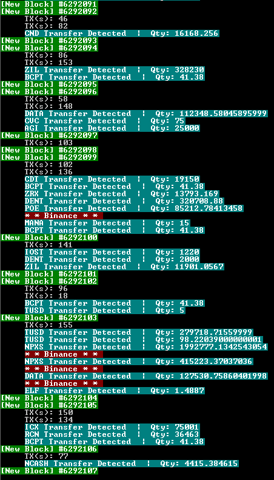

# BlockSpy
BlockSpy is a live tool to track ERC20 tokens transfered over the Ethereum network, written in NodeJS

# Screenshot


# Add Coins
ERC20 token to search for are located in data.json and are in the following format:

```
[
  {
    "symbol": "ADX",
    "contract": "0x4470BB87d77b963A013DB939BE332f927f2b992e",
    "decimals": 4,
    "abi": ABI
  }
]
```

# Requirements
A parity ethereum node running on port 8545
const Web3 = require('web3');
const fs = require('fs');
const express = require('express');
const InputDataDecoder = require('ethereum-input-data-decoder');
const chalk = require('chalk');
const hexToDec = require('hex-to-dec');
const beep = require('beepbeep')
const app = express();
const request = require('request');
const ftp = require('ftp');
